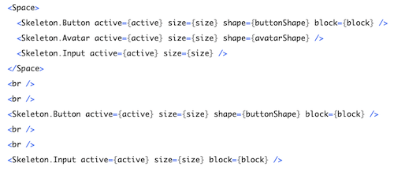
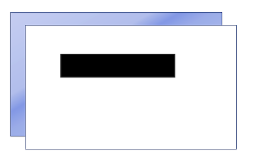
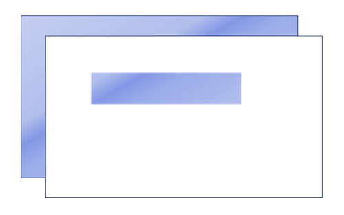
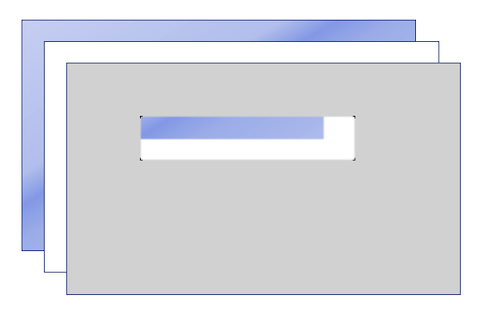
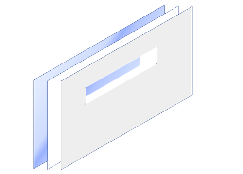
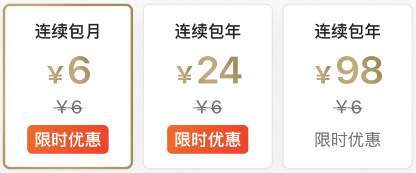

[中文](./Instruction.zh-cn.md)

# Motivation

Recently, I encountered a need to implement skeleton screens. I roughly surveyed the skeleton screen solutions that are commonly used in the market and found that many of these solutions cannot meet my needs, such as:


or


From the first picture, we can see that the elements in the skeleton screen have their own independent animation effects, that is, the "waves" among them do not run from the left element to the right element, but run separately from the left of each element to the right of each element. This looks somewhat inelegant.

The second example uses a color gradient for the whole to avoid the problem exposed in Figure 1. By removing the "wave" effect, the animation effect of the elements appears to be uniform, but this obviously makes the page less dynamic.

In addition, both of these skeleton screen components use similar interfaces.




It can be seen that this kind of interface design basically determines that the elements in the skeleton screen can only be circular or rectangular, and the layout method is relatively fixed. At the same time, the animation effects are also relatively fixed, only gradient and "wave".

Another type of skeleton screen solution is implemented using svg's clipPath. It basically solves the above problems, but the disadvantage is that it is a bit difficult to use. Many front-end colleagues have not written svg themselves, and are not familiar with the usage and characteristics of svg technology, so the author of this solution even specifically implemented a generator tool to allow users to generate a set of configurations using this skeleton screen component through the gui interface. It can be seen that the threshold for use is not low.

So is there a way to achieve elegant effects and flexible configuration interfaces while being easy to use and quick to get started?

# Solution

First of all, a CSS animation effect can only be executed on a single DOM node, so it is definitely not feasible to set animation effects separately for each element in order to achieve the "wave" effect flowing between elements. Therefore, in order to achieve a "wave" that can flow between elements, we give the skeleton screen a full-screen background element, and execute the "wave" animation effect on the background element, and then implement a mask with a hollow window through some means.

To implement a mask with a hollow window, the simplest and most intuitive solution is to use several opaque elements to cover up the positions that do not need to be hollowed out, leaving the places that need to be hollowed out.

This is relatively easy to handle for rectangular hollow areas, but it is difficult to implement if the hollow area is circular or other complex shapes. Moreover, as can be seen from the figure above, such a solution will be very cumbersome to implement, especially when the size of the skeleton screen elements needs to change according to the outside environment, the implementation difficulty of this solution will become higher, and the code will be difficult to maintain.

So, how can we implement a simple and easy-to-maintain mask?

At this point, we need to introduce the focus of this article: [mix-blend-mode](https://developer.mozilla.org/en-US/docs/Web/CSS/mix-blend-mode).

```mix-blend-mode``` is used to control the layer blending mode of colors, there are a total of 16 modes, among which we focus on the two modes: ```darken``` and ```lighten```. The logic of these two blending modes can be found in [this link](https://en.wikipedia.org/wiki/Blend_modes). It can be seen that the algorithms of these two modes are actually very simple. In the darken mode, the two colors are blended by taking the minimum value of each of the colors in the R, G, and B channels, while in the lighten mode, the two colors are blended by taking the maximum value of each of the colors in the R, G, and B channels.



Now, considering the scene in the above figure, the outer layer of the upper layer is white, and the middle rectangle is black. If we set the ```mix-blend-mode``` of this layer to ```lighten```, the white area of the outer layer will still be white since white is already the maximum value in the R, G, and B channels. However, the black rectangle in the middle will become the color of the lower layer since black is already the minimum value in the R, G, and B channels. The final effect is as follows:



At this point, we have already achieved a simple skeleton screen effect using ```mix-blend-mode```!

Furthermore, if we want the non-animated part of the skeleton screen to be a color other than white, what should we do? Perhaps you have already thought of it. We use ```mix-blend-mode``` to take the color once again based on the previous foundation.

As shown in the figure above, we construct another "mask". This time, we set the outermost layer of the top layer to the desired color of the skeleton screen's outer layer, set the middle rectangle area to white, and then set the ```mix-blend-mode``` of this layer to ```darken```. In this way, since the white color in the lower layer has already been the maximum value in the R, G, and B channels, the color of the top layer will be taken when blending in the ```darken``` mode. The color of the middle rectangle area will be the same as the color of the lower rectangle area for the same reason.




As a result, a skeleton screen component with a color range that can be defined arbitrarily is implemented.

Summary
Through the example above, you should have discovered that using ```mix-blend-mode``` to achieve the mask effect is not only flexible and diverse in terms of functionality, but also very easy to use. Front-end developers only need to write basic DOM structure and style to quickly get the desired effect.

Moreover, based on the ```mix-blend-mode``` mask, it can also be used in many other scenarios, such as the effect below. The gradient effect of the option's border and the amount character inside the option is continuous. Without using a mask, the designer can only directly create an image to achieve this effect, which will increase complexity in internationalization, dark mode, and multi-resolution adaptation scenarios. However, using a mask to achieve this effect becomes very simple.

